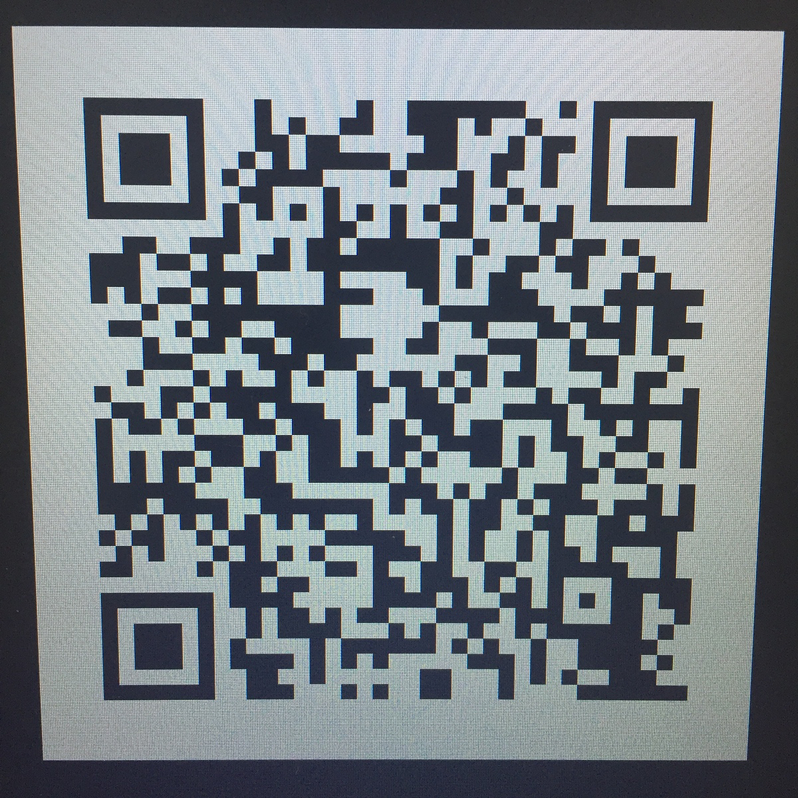
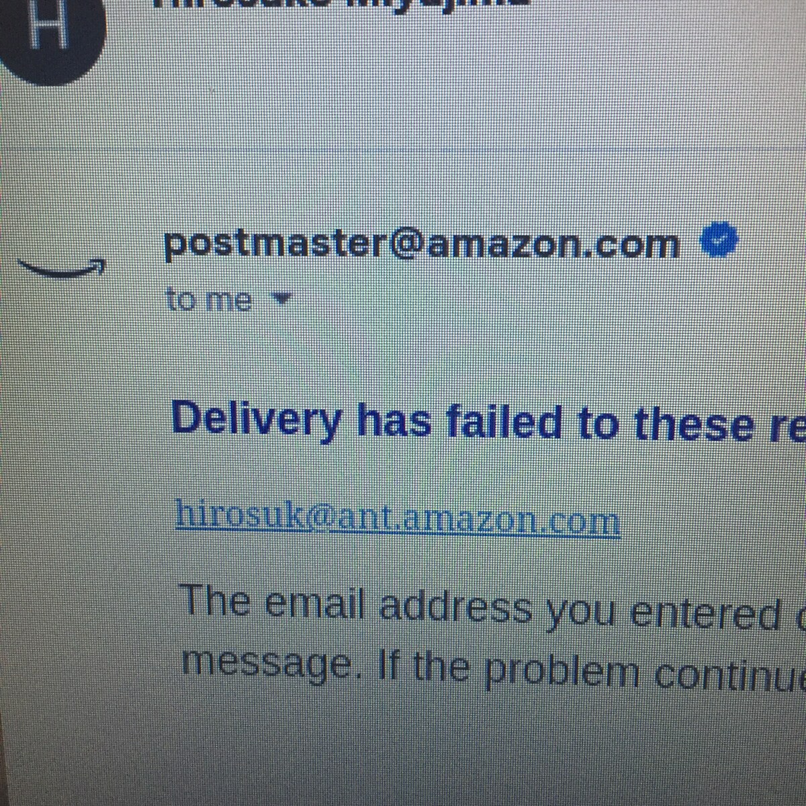

# katkit
### NOTE: I quit Amazon on August 8, 2024.  

### 24. 9. 7 
- PS: YouTubeにも解説を追加しました。
  - https://youtu.be/ZcVx31LPnuI
  - https://kangdaegae.web.fc2.com/misc/ipoint/2024/kim.mp4
- 以前このホームページで紹介した「前ソウル警察庁長の김광호がイテウォン惨事への対応に関連して禁錮5年を求刑された」というニュースですが、現在のところ日本語を使って当該ニュース記事を検索することは出来ません。更に奇妙なことに英語でも、中国語でも検索が出来ないのです。つまり皆様のようなコンピュータ上でハングルを入力する方法をご存知でない方々は一生このニュースをお知りになることが出来ないということです。イテウォン惨事の犠牲者の中には韓国人でない方々も多くおられたと思うのでどうしてこのような、あたかも本ニュースを韓国語圏内に封印するような措置が取られているのか私にはさっぱり分かりません。皆様がこのニュースをご覧になりたければ単にGoogleで「김광호」と検索すれば良いのです。ですが皆様の大半がハングルの入力方法をご存知でないでしょう。iPhone等スマホであれば設定メニュー内の「キーボード」とやらをいじって韓国語キーボードを追加すれば良いだけなのですが、それさえも面倒ならGoogleで「korean keyboard」と検索するとWeb上でハングルを入力するためのツールが現れます( www.branah.com/korean )。「김광호」を入力するには単に「ㄱㅣㅁㄱㅗㅏㅇㅎㅗ」という風にタイプすれば良いのです。
  - 

### 24. 9. 5 
Yahooニュース等日本語のニュースサイト 及び 産経新聞にはそれについての記事が見当たりませんでしたが、今月2日、김광호前ソウル警察庁長が梨泰院惨事への対応に関連して禁錮5年を求刑されています。

下記はニュース記事へのリンクですが、ですからホームページにも書いたこれはフェイクではなく事実です。なぜ日本の新聞社がこれを取り上げないのかさっぱり分かりませんが(この方が起訴された際には日本でも報道されたと記憶していますが)。

- https://www.hani.co.kr/arti/society/society_general/1156615.html

- https://www.yna.co.kr/view/AKR20240902131152004

- https://youtu.be/RByFh9Vtq6Q

#### 24. 8. 27 
- 私がアマゾンから付与されていた下記のメールアドレスですが、ようやく削除されたようです。試しにここに何か送ってみて下さい。
  - hirosuk@amazon.co.jp
  - 

#### 24. 8. 26 
- https://github.com/anissatta/katkit/tree/main/coevo

#### 24. 8. 23 
- **UPDATE:** 各動画をZIPファイルにまとめたものをGoogle Driveにもアップロードしました。下記リンクをクリックすると右上に出てくるダウンロードボタンを押し、解凍してから各ファイルを再生して下さい。この方法ですと元の画質(FullHD)で視聴することが出来ます。
  - https://drive.google.com/file/d/17-N1tLDd9UDgoIlWxxXchLnWB6jh7Mw-/view?usp=sharing
- 若干画質は落ちますが、下記にも銀行で撮影した動画を保管しています。
  - https://github.com/anissatta/katkit/tree/main/aug23

#### 24. 8. 14 

私は既に退職していますので、アマゾンの社内ネットワーク(イントラネット)において私に関する情報の削除がどこまで進んでいるのか確かめる術はありません。(メールアドレスについてはまだ消されていないようです)ただ社内ニュースサイトやWiki等に書き込んだ内容は恐らくかなり長期間残留するものと思われます。

というのも彼女が退職された後、うろ覚えですが確かMCM(mcm.amazon.com)とかいう社内システムにアクセスし検索したところ、彼女の業務日報のようなものがそっくり残っていたからです。PhoneTool上では彼女のデータは'Inactive'になっていました。

ですから私が退職前から述べているような、社内ニュース記事の日付を操作して私が最近記事を「いいね」したように見せかけるテクニックは今後も永久に続けられることと思われます。

私がどうしてこれを今日書こうと思ったかというと、明日は光復節でしょう?過去の経緯からしてもアマゾンが光復節や三•一節、あるいは梨泰院惨事のあった日に合わせてこのテクニックを使用する可能性は高いのですね。というのもアマゾンにとって韓国における評判が割と重要なのだからだと私は思いますが。

このテクニックを看破するには前にも書いたように、該当の記事にコメントが付いている場合はその中で一番古いコメントの日付を見れば良いのです。記事の投稿日時がいじられている場合、コメントの日付が記事より古くなっている可能性が高いのですね。

社内ニュースサイト(AtoZ News)における上記のような操作はアマゾン社員の方々がこういったことに注意して、より正確な情報を世間に流すようにすれば無効化出来るものなのです。

アマゾン社員の方々にもう一つお願いしたいのは社内ニュースサイト以外の私に関するデータがどのようになっているか調べ、それをご友人などにもシェアして頂きたいということなのです。

例えば、私の退職前には下記URLを開く事で私の顔写真etc.が閲覧出来ましたが現在はどうですか?

https://fclm-portal.amazon.com/employee/activityDetails/ppa?employeeId=hirosuk&warehouseId=KIX3

PhoneToolはどうでしょうか?もっとも日本のL1アソシエイトは元々PhoneToolに個人情報が表示されなかったのですけど、在籍の有無はこれで確かめられるようになっていました。

https://phonetool.amazon.com/users/hirosuk

私は社内ニュースサイトだけでなく、下記のブロードキャストという社内サイトにもコメントを書いていたのですが、それらはどうなっていますか?

https://broadcast.amazon.com/videos/1164523

https://broadcast.amazon.com/videos/1175575

かなり前には社内Wikiにもコメントを書いていました。下記のページ内にhirosukによるコメントがあるはずですが、現在も顔写真が表示されていますか?(書込みは数個あります。あと時刻表記がUTCであり日本時間でないことに注意) 

https://w.amazon.com/bin/view/Associate2Tech/#Comments

アマゾンが私の退職後も上に述べたようなことを行なっている可能性は高いと思いますが、それは多分彼女に影響を与えることはないと思います。人事部が全ての連絡をメールで行ったのはあまり賢明とは言えませんでしたね。(これは冗談です) 

---- 

- 8/5: 最近私が夕食後に近くのスーパーでインスタント麺等を買うようになったからか変な噂が流れているようなので下記を再掲いたします。(ただ噂を信じているのは今のところご近所の高齢の方々だけだと思いますが) 
- 下記は私が日々のスーパーでの買い物時に使用しているプリペイドカードの番号と、利用履歴を照会する為のサイトのURLです。
  - :shopping_cart: KONOMIYA 
    - ID: 8804-9010-0696-8023
    - PIN: 735157
    - https://www.vcsys.com/s/konomiya/m/
  - :shopping_cart: TOP WORLD 
    - ID: 8886550092228199
    - PIN: 157544
    - https://nir001.ppsys.jp/ZZ11FSUZHS/Login/cardLogin

- :smile_cat: 韓国や(トップワールド・コノミヤが店舗を展開していない)関西以外の地域にお住まいの方々が私がこれらのスーパーマーケットでの買い物時に使用しているプリペイドカード、とくにその利用履歴照会サイトについて疑問を抱くのは当然だと思います。(URLが少し変ですし、私がいつも切りの良い金額を支払っているからです)ただまずトップワールドについて述べるとこれのプリペイドカードの残高照会サイトのURLはトップワールドの公式ホームページに記載されているのですね。下記のページをスクロールしていくと「電子マネーMottokuカード残高照会ページ」というリンクがあるのでそれをクリックするとそれが表示されます。
  - https://topworld.jp/
- またトップワールドに設置されているプリペイドカードチャージ機の形状がコノミヤにあるものと瓜二つであることや、残高照会サイトのデザインまで似通っていることに気付かれた方もおられたかも知れません。これは何故かというとこれらのスーパーマーケットは自社でこういったシステムを開発している訳ではなく、どうもどちらも同じ(バリューデザイン社というシステム会社の)パッケージを流用しただけのようでありその為だと思われます。下記のバリューデザイン社の導入実績ページにもトップワールドが紹介されていますね。
  - https://cs.valuedesign.jp/case/list/topworld
- コノミヤプリペイドカードの残高照会サイトのドメイン名である「vcsys.com」をGoogleで検索すると他のスーパーマーケット等の残高照会サイトが表示されますから、恐らくこれはバリューデザインが所有するドメインの一つであり、その一部をコノミヤが使っているのだと思います。謂わば一つのアパートの各室にスーパー各社が居住しているようなものです。コノミヤの同居人の一つであるスーパーハートのホームページを以下に示しますが、ここで使われている「モ〜ちゃんカード」の残高照会サイトのURLが「 https://www.vcsys.com/s/nakayama-farm/p/ 」であることがお分かりになることでしょう。(下部にある「残高照会へ」をクリックしてみて下さい)
  - https://heart.nakayama-farm.jp/card/

---- 

- :new: A gift for my beloved one, #3 
  - https://anissatta.github.io/katkit/mi-joya/index.html
- A gift for my beloved one, #2, *unfinished* 
  - https://anissatta.github.io/katkit/kiri/index.html
  - NOTE: *am-somewhat* conquers all.  
- A gift for my beloved one, #1 
  - https://anissatta.github.io/katkit/saranghae/index.html

- **UPDATE2:** I even uploaded the videos on YouTube after concatenating 'em into a single vid file: 
  - https://youtu.be/O9tZJC1A11w
  - NOTE: It's an *unlisted* one.  
- **UPDATE:** My 3rd visit to Korea: 
  - https://kangdaegae.web.fc2.com/misc/sk3/

This is an excerpt from the part of my website which exists somewhere on the Internet. 

https://anissatta.github.io/katkit/index.html

Screenshot: 

