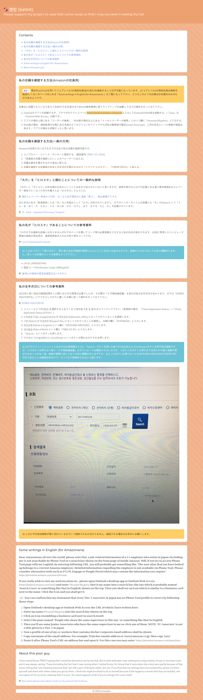

# katkit

- 8/5: 最近私が夕食後に近くのスーパーでインスタント麺等を買うようになったからか変な噂が流れているようなので下記を再掲いたします。(ただ噂を信じているのは今のところご近所の高齢の方々だけだと思いますが) 
- 下記は私が日々のスーパーでの買い物時に使用しているプリペイドカードの番号と、利用履歴を照会する為のサイトのURLです。
  - :shopping_cart: KONOMIYA 
    - ID: 8804-9010-0696-8023
    - PIN: 735157
    - https://www.vcsys.com/s/konomiya/m/
  - :shopping_cart: TOP WORLD 
    - ID: 8886550092228199
    - PIN: 157544
    - https://nir001.ppsys.jp/ZZ11FSUZHS/Login/cardLogin

- :smile_cat: 韓国や(トップワールド・コノミヤが店舗を展開していない)関西以外の地域にお住まいの方々が私がこれらのスーパーマーケットでの買い物時に使用しているプリペイドカード、とくにその利用履歴照会サイトについて疑問を抱くのは当然だと思います。(URLが少し変ですし、私がいつも切りの良い金額を支払っているからです)ただまずトップワールドについて述べるとこれのプリペイドカードの残高照会サイトのURLはトップワールドの公式ホームページに記載されているのですね。下記のページをスクロールしていくと「電子マネーMottokuカード残高照会ページ」というリンクがあるのでそれをクリックするとそれが表示されます。
  - https://topworld.jp/
- またトップワールドに設置されているプリペイドカードチャージ機の形状がコノミヤにあるものと瓜二つであることや、残高照会サイトのデザインまで似通っていることに気付かれた方もおられたかも知れません。これは何故かというとこれらのスーパーマーケットは自社でこういったシステムを開発している訳ではなく、どうもどちらも同じ(バリューデザイン社というシステム会社の)パッケージを流用しただけのようでありその為だと思われます。下記のバリューデザイン社の導入実績ページにもトップワールドが紹介されていますね。
  - https://cs.valuedesign.jp/case/list/topworld
- コノミヤプリペイドカードの残高照会サイトのドメイン名である「vcsys.com」をGoogleで検索すると他のスーパーマーケット等の残高照会サイトが表示されますから、恐らくこれはバリューデザインが所有するドメインの一つであり、その一部をコノミヤが使っているのだと思います。謂わば一つのアパートの各室にスーパー各社が居住しているようなものです。コノミヤの同居人の一つであるスーパーハートのホームページを以下に示しますが、ここで使われている「モ〜ちゃんカード」の残高照会サイトのURLが「 https://www.vcsys.com/s/nakayama-farm/p/ 」であることがお分かりになることでしょう。(下部にある「残高照会へ」をクリックしてみて下さい)
  - https://heart.nakayama-farm.jp/card/

---- 

- :new: A gift for my beloved one, #3 
  - https://anissatta.github.io/katkit/mi-joya/index.html
- A gift for my beloved one, #2, *unfinished* 
  - https://anissatta.github.io/katkit/kiri/index.html
  - NOTE: *am-somewhat* conquers all.  
- A gift for my beloved one, #1 
  - https://anissatta.github.io/katkit/saranghae/index.html

- **UPDATE2:** I even uploaded the videos on YouTube after concatenating 'em into a single vid file: 
  - https://youtu.be/O9tZJC1A11w
  - NOTE: It's an *unlisted* one.  
- **UPDATE:** My 3rd visit to Korea: 
  - https://kangdaegae.web.fc2.com/misc/sk3/

This is an excerpt from the part of my website which exists somewhere on the Internet. 

https://anissatta.github.io/katkit/index.html

Screenshot: 

