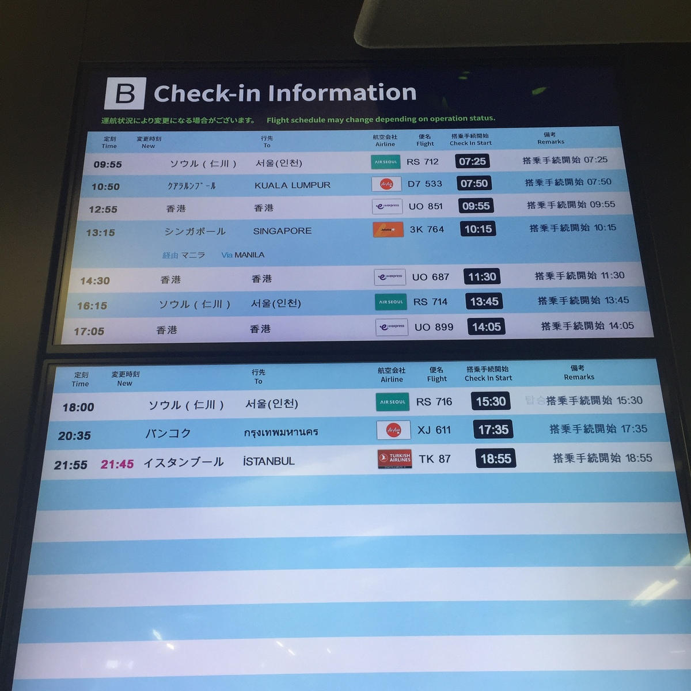

# 2024年7月 韓国訪問記

> まだ記憶が鮮明である内に3日間の出来事を記録しておこうと思い、この韓国訪問記を作成しました。

### 2024年7月8日
この日かなり早い時刻に自宅を出発したのですが(朝食は以前コノミヤで買ったキムチラーメンで済ませました)、まだ薄暗いというのに駅までの道中で自転車に乗った若者や、朝まで酒を飲んでいたと思われる上半身裸の若者等を見ました。阪急富田駅は地下に改札があるのですが私が到着した時点では駅員はおらず、改札機にICOCAをかざしても反応しませんでした。しばらくするとウォーキングをしていたと思われる年配の方が来られたり、恐らくトイレを利用するためでしょうが男性が勝手に改札の中に入って行かれたりしました。始発電車が到着するまでには改札機のランプが点灯し、それから中に入りました。

関西空港駅までの出来事については省略しますが、今回も行き帰りの天下茶屋〜関空間は南海電車を利用しました。関西国際空港の自動チェックイン機のメニューには今回利用したエアソウルのボタンがなかったのでカウンターでチェックインをすることにしましたが、搭乗手続開始時間になり列に並んでいると外からニヤニヤ笑いながらこちらを見ている黒い服を着たアジア人の男性がいるのに気づきました。

この男性は私がカウンターに行ってパスポートと今回航空券の予約に利用した代理店(エアトリ)発行の書類を渡すやいなや去って行ったので何を考えてそこに立っていたのかが分かったのですが。

今回現地でホームページを更新するために(かなり大きな)ノートパソコンを持参していたので検問を通るか心配だったのですが、もちろん何の問題もなく通過することが出来ました。前回チェジュ航空を利用した際には第二ターミナル発だったので陸地を走るバスに乗ってそこまで移動した記憶があるのですが、今回は電車のようなものに乗ってのターミナルへの移動でした。ターミナルに着くやうどんの出汁の匂いがし軽食店があるのが分かりましたがかなり高く感じられたので何も食べずに行くことに決めました。

エアソウルRS712便の搭乗開始時刻は予め伝えられておりチケットにも印刷されていたのですが、「必要機材の到着が遅れたため」25分から40分に変更とのアナウンスがありました。ゲートの前には列が出来ていたので並んでいると機内乗務員達が私を見てニヤニヤしているように思われこの辺りからイライラしてきていました。(私は空腹になるとイライラする傾向があります)

機内に入りチェックイン時に指定された通路側の座席に座っていると後から来た若い女性と中年の男性のカップルがその内側に入ってきましたが、この女性が終始甲高い声で下らない話をし続けたのでイライラし熟睡することが出来ませんでした。機内乗務員は入国カード記載時に使う使い捨てのペンを私には渡しませんでしたが、このようなことは初めて韓国に行った際にも経験していたので(2回目ではちゃんとくれましたが)持参していたボールペンで記入を行いました。(ただこのカードは入国審査員には見せた記憶はありますが、回収はされませんでした)

インチョン国際空港に着くと若干雨が降っているようだったので急いで到着を報告せねばと思い(私は彼女の気分がすぐれない時に雨が降るという非科学的な信念を持っていますが、今回も9日の夜にソンナムではありませんが大雨があったようです。第一回目の訪問では初日にカンナム区で集中豪雨が降りました)携帯電話を取り出しましたがなぜか構内の無料Wifiからでは自分のブログの更新が出来なかったのでとりあえずさっさと入国審査を済まして外に出ることにしました。

初回の韓国訪問時には空港内のコンビニでSIMカードを買い、二回目はその同じコンビニでSIMカードが買えるかと尋ねると「オッゾヨ」(ありません)と言われたので仕方なく近くにあった小さな本屋で買ったのでした。(先に述べたエアソウルのこともそうですが、私がこういった嫌がらせを韓国の方々から受けるというのを皆様は奇妙に思われるかも知れません。こういったことは以降にもちょくちょく出てきます)ただ今回は違う出口から出たからなのかも知れませんがその本屋が見つからないのでうろうろしているとSIMカードを専門に扱っている店があり日本人のおばさん達が群がっていたので私もそこで買うことにしました。

早速買ったSIMカードを携帯電話にセットしその旨をブログで報告しました。その時点でまだ昼食を食べていなかったのですが、私が気軽に入れそうな店が見当たらなかったのでCUというコンビニでツナキンパ(海苔巻)と栄養ドリンクを買ってキンパの方を花壇のようなものの隅に座って食べました。

それから航空鉄道(AREX)でソウル駅に行き、地下鉄で東大門歴史文化公園駅経由でワンシムニ駅に行きました。(ソウル駅でこれは行きと帰りのどちらで見たか忘れましたが、前回ソウル駅で見た釜山万博についての大きな掲示物が裏返されているのを見ました)ワンシムニからスイン・プンダン線に乗り換えホテル(モーテル)の最寄り駅であるスネ駅に向かうつもりだったのですが、前回ソンナム市に行った際にはチョンニャンニ駅から行こうとして失敗したことがありました。(チョンニャンニから出る電車の本数がかなり少なかったからです)ちなみに私がソンナムにばかり行っているのは彼女がインターネット上で公開されている経歴書に一時ソンナム市についての記載があったからですが、今思うと迷惑だったかも知れず申し訳なく思っています。

モーテルのチェックイン時間は18時だったのであまり急ぐ必要もないと思いとりあえずワンシムニ駅に隣接しているeマートを見学することにしました。ここはスーパーとホームセンターを合体させたような店なのだろうかと思いましたが、奥の方では日本のスーパーで見かけるような出店のようなものがあったりして高齢の方も買い物をされているようでした。計算台を見ていると年配の方が現金で支払おうとされていたり自動精算機にも現金の挿入口があるようだったので私も何か買おうかと思いましたが止めておきました。(私はこれまで一度もクレジットカードを作っておらず韓国でも現金のみで決済を行っています)私が働いていた倉庫と同様にパレットに載せた商品を引っ張っておられる店員の方がおられましたが日本ではあまり見ない光景のようにも思われました。

前回ソンナム市を訪問した際には月の市が開催されたりするモランやキューブ美術館(ソンナムアートセンター)があるイメなどといった駅で降りたのですが、今回はそれより更に先のスネ駅で降りました。後で気づいたことですがこの駅の隣にはソヒョンという駅があり、そこには前回の訪問時にも行っていたのですがプンダン区庁はその間に存在しています。またその並び沿いに川があり郊外の方に行くとまだ自然が残っているような印象もありました。改札は地下にあるのですがそこから書店に入ることが出来るようになっておりこれはロッテデパートの一部であることが分かりました。地上に出て今回泊まったモーテルの方角に向かうと飲食店が並ぶ通りがありましたので(雨が降っていたので)折り畳み傘を取り出ししばらく散策することにしました。なお今回泊まったモーテルである「JJホテル」ですがインターネットによると同名のホテルが駅からやや離れた所にもあるようです。

先に書いたように規定のチェックイン時間は18時だったので先に夕食を済ませることにしました。上に書いた飲食店通りやその通りに面するビルの内部等食事をする場所は無数にあるように思われました。しばらく歩いていると「ポンガ(本家?)へジャンク(酔い醒しスープ)」というものとその価格が印刷された掲示物が見えそこは何となく入りやすそうな店だったのでそこに決めました。(その掲示物には他にも色々とメニューが書かれていました)後でレシートを見て調べてみましたが、下記の「장수본가해장국」という店だと思います。

- https://www.diningcode.com/profile.php?rid=RtoaCuzIYznS

中に入ってポンガへジャンク、ハナと言うと先に2種類のキムチと何かたれのようなもの、刻んだ青唐辛子(チョンヤンコチュ？)が入った容器、ご飯が入った器(コンギ)を持ってきてくれました。(箸やスプーンはテーブルの引き出し内から各自取り出します)スープもまもなく運ばれてきましたが、よく分かりませんが何かの肝臓と牛の胃袋を刻んだものと思われるもの等が入っていました。周りを見渡すと焼酎を飲みながらスープを食べている男性や、学生だろうと思いましたがわいわいと話しながら食事をしている団体客などがおられました。食事を終えて代金である1万ウォン札を持ってレジに行くと「マンウォン？？　？？　オットン　へジャンク　？？ヨ？」といった風に言われたのでポンガへジャンクと言うとその答えで良かったのかいまいち分かりませんでしたが、また何か聞かれたので「エー」(はい)と答えるとレシートを渡してくれました。(今考えるとこれは私の韓国語力を検査していたのかも知れません)それからまた少し歩きましたが、少し早く行ってもチェックイン出来るだろうと思い飲食店街側の入口からモーテルに入るとそこは駐車場になっており自動車を回転させる台のようなものが地面に埋め込まれていました。

駐車場の奥からフロントに入り代理店発行の書類を渡すと「2デイズ？」と聞かれたので「2ナイツ」だと言うと卓上カレンダーを見せられ10日チェックアウトでいいかと言われたのでそうだと答えました。それからカードキーを渡されましたが部屋番号は402でした。室内に入りテレビをつけてみると「信号なし」と表示されたのでリモコンを色々と操作してみましたが効果なしでした。冷蔵庫を開けるとミネラルウォーターやサイダー、甘酒のようなものが入っていました。今回はある目的から旅行中にホームページの更新を行うことにしていたので早速パソコンを取り出しその作業を行いました。今回これを行ったおかげか旅行中に私が餓死するのではないかという噂が発生することが防げていたように思われます。(人々は私が日常的にインターネット上で行っている活動を中断しただけで生身の私が死ぬと思うのですから、馬鹿馬鹿しいですね)ただ私がそのパソコンが入っている大きな鞄を持って歩いていたので別の噂が流れていたような気がしましたが。

作業を終え駅の方に歩いて行って帰りにコンビニで酒やエースという韓国のクラッカー等を買ってホテルに戻り、飲酒後就寝しました。

### 2024年7月9日
昨日の旅の疲れがまだ残っていましたがいつものようにかなり早い時刻に起床し、備え付けられていた個包装のインスタントコーヒーを作り、「エース」を浸して食べました。以前韓国語でネイバーの本社を見るつもりだと書いていたので調べると前日の晩に見た川沿いの道を歩いていけば日が昇る頃には到着できるような感じだったので早速出発することにしました。川沿いの、車道の脇にある歩道を歩いていきましたが、土手の中の草が生い茂る中を散歩されている方々がおられたのでどうすればそこに行けるのだろうかと不思議に思いました。というのは土手の下に降りる階段にはいずれも「危険」とか書かれたテープが張ってあったからです。後で自分でやってみて気付いたのですがどうも皆そのテープの下をくぐって中に入られていたようです。途中カササギかと思われる(ソンナムFCのマークにもカササギが描かれています)鳥を何度も目にしました。

私が歩いていた一帯は高層の集合住宅が立ち並んでおり団地を形成しているようでした。各ビルにはビルの名称等が書かれていました。辺りはまだ薄暗かったのですが、教会の近くのスネからネイバー本社に向かって左手の草むらにて猫を見かけそれが大部分が白色の猫だったので本当にホッとした気持ちになりました。またその左手の方には煉瓦で出来た建物が立ち並ぶ区域になっており、駐車場がないからか建物の前に自動車がずらっと、いずれも斜めに路上駐車されていました。そちらの方に入ってみましたが、看板屋があったりしましたがどういう地区なのかはよく分かりませんでした。元の川沿いの道に戻り、携帯電話の地図アプリを頼りに橋を渡って右手に進むと飲食店等が入居する複合ビルがある区域に入りましたがその時間はまだ飲食店は開店していないようでした。(今回いくつもの店でスイカジュースの看板を見たのですがせっかくなので飲んで見みればよかったかなと思います)ネイバー本社ビルの前まで行こうとしましたが、本社ビルの隣の建物で工事を行っていた関係で先に進めそうもなかったので引き返すことにしました。

今度は対岸沿いの道をスネ方面に歩き出しましたが、既に人々が歩きだしており私を見て頭をポリポリ掻いている方もおられました。モーテルのあるスネ方面に行くための橋を渡るまでに川岸に降りてみたかったので階段に張ってあったテープを無視して入り、サイクリングロードを渡ってからウォーキングをする人々の流れに加わりました。

モーテルに戻り、今朝撮影した写真等をホームページにアップロードしてから再度外に出ましたが、この日をどう送るべきか見当がつかずまたこのまま一生彼女とお会いすることは出来ないのではないかという絶望感がこみ上げてきてきました。また朝ネイバー本社を見に行くためにかなり歩いたのでサンダルで足を擦りむいてしまい近所のビルの谷間にある広場のような所でしばらく休んでいました。(その前にスネ駅のモーテルとは反対側にあるマクドナルドで軽食をとろうと考えていたのですが、外から明らかにクレジットカード専用と思われる注文機が見えたので諦めました)それから気を取り直し歩き出しましたが、トイレに行きたくなったので歩道橋を上がって左手を見るとロッテデパートの入口があるようでした。ただ時間が早かったのでその近くにある周辺地図を見ましたがプンダン区庁が近くにあるのと、それから目視で付近にクリスタルビルとかいう複合ビルがあるのが確認できました。日本だとそういうビルにトイレがあり誰もが利用出来る場合もあるのでそちらに行ってみましたが、何となく部外者が入りにくい感じだったのでその先までしばらく歩きました。(途中「DAISO」と書かれた一見日本のダイソーとそっくりの店を見ました)そこには学校があってスクールゾーンになっていたようでしたがこれも居づらい感じがしたのでやはり区庁方面に歩き出すことにしました。

前回の韓国訪問時に行ったプンダン中央公園の側に広い芝生があるのを見ていたのですが、区庁はその向かい側にあるようでした。また芝生と区庁との間に公園のような空間がありそこを通って区庁にアクセス出来るようになっていました。その近くに公衆便所があったのでそこで用を済ませました。

区庁の周辺にあるビルの1階部分には何か刺身(フェ)の店やキンパの店(「デイリーキンパ」)があったのですが、そこでキンパを買おうと思い携帯電話でその店のホームページを見たり、窓越しにメニューを確認したりしました。そこはキンパの他にもラーメン等の粉食も扱っているようでした。店内に入るとクレジットカードで決済するタッチパネル式注文機があったので紙幣を手にしながらカードがないことを説明すると何か聞かれたので「店内か、持ち帰りか」を聞いているのだろうと思い頷きましたが意図は逆に伝わったようでその後席に座って給水器の水を飲んでいると店員が怪訝な顔をしているような気がしました。当初なぜかキムチキンパがあると誤解(誤読)していたのですが、ないと言われ「チャムチ(ツナ)キンパ」かと聞かれたのでそうですと答えました。支払いを済ませ店内で待っていると反対側(建物内)の方から笑顔を浮かべた中年の女性が来られ注文機で何かオーダーされていました。

そのデイリーキンパ(데일리김밥)で買ったツナキンパは上で述べた区庁と芝生の間にある公園のような空間でベンチに座って食べました。ブログで区庁近くにいることは伝えていたのであまり移動しないつもりでしたが区庁の本館から更に奥に進むと恐らく日本で言う市民サービスセンターのような建物が見え、その先には座る所があったのでしばらくそこで駐車しに来る自動車を見たりしていました。携帯電話の地図アプリを見るとそこからソヒョン駅方面に移動するとロッテマートというスーパーのようなものがあるとのことだったのでそっちに行ってみましたが、結局ロッテマートがどこにあるのか分かりませんでした。(地図アプリ(maps.me)が示すその位置にはサムソンかLGの店があるよく分からないビルがあっただけでした)途中違法駐車を発見する為の車両だと思いますが何やら装置を屋根に装着した車が巡回しているのを見ました。しばらく歩いているとパジャマのような服を来た男女が路上で話していたのでとっさに引き返しましたが、病院があったのかも知れませんが何かの勘違いかも知れません。ソヒョン駅周辺には前回も来たことがあり、昼食をそこで摂ろうかとも考えましたが彼女が悲しむかもしれないと思い直し区庁の方に戻ることにしました。

「区庁と芝生の間にある公園のような空間」に戻ってそこで約1時間を過ごす旨ブログでお伝えしました。その後恐らく私を観察に来られたと思われる方々を見ましたが、とりあえず周辺を撮影したりぶらぶらと散歩したりして過ごしました。近くにある何らかの建物の前に猫らがおり私もそれを近くで見たかったのですが、黒い服を来た若い女性が延々とその猫を撫でていたので近づくことが出来ませんでした。しばらくしてその女性や恐らく区庁関係と思われる方がどこかに行かれたので私も側に寄って猫を撮影したりすることが出来ました。(先の女性が撫でていた際には背中黒、腹白の猫もいたのですが私が撮影出来たのは背中黄、腹白の猫のみでした) 

予告した1時間間際になり高齢の女性2名が私が座っていたのと隣のベンチに腰掛けられ何やら話されていましたが、私はインターネット上で区庁本館地下にある構内食堂に行ってみたかったのでその旨ブログで報告し予告時刻になった後早速区庁に行ってみました。私の頭の中には日本の市役所の食堂のように誰もが利用できる安く独特の味わいがある食堂があったのですが、行ってみると(恐らく)市民の方々が携帯電話の画面を何らかの機器にかざし食券を買わずにわいわいと奥に行かれていたのでこれは市民専用の食堂か、あるいはQRコード決済しか受け付けない食堂なのだなと判断し退去することにしました。

スネ駅方面に戻りつ食事をする場所を探しましたが、雨が降り出してきたのでこれは彼女が私が昼食を買う金もないのではないかと心配しているに違いないと思い急いであたりを捜索しました。スネ駅前飲食店街にあるビルの地下にカルククス(麺類)か冷麺だったと思うのですが、安く食事が出来そうな店があるようだったので行ってみたのですが何となく入りにくそうだったので止めておきました。またその同じ地下階にはマッサージか何かのいかがわしそうな店があるようでした。どこで食事を摂るべきか迷いながら辺りをうろうろしていたのですが、早く彼女を安心させねばならないと思い前日に前を通っていた豚肉炒め定食のようなものを扱っている、豚のマネキンが前に飾られている店に入ることにしました。後でインターネットで調べてみましたが、ここは「막내쌈밥」という店らしいです。下記はこの店についてのページです。

- https://www.diningcode.com/profile.php?rid=JBL2vJoOwKRP

店に入り誘導された席に座ると黒い服を来た男性が来られたので確かメニューにある11,000ウォンの一番安い定食を指差しました。(ただ会計の際に13,000ウォン取られたので注文がうまく伝わっていなかったか、私がここのシステムを理解していなかったのかも知れません)すると大根の酢漬けのようなもの(私はこれに箸をつけると油が浮いてしまい残った分を捨てなくてはいけなくなると思い手をつけなかったのですが)、一見メンマかと思ったのですが恐らくオムク(韓国のかまぼこ)を煮たもの、コールスロー、ワカメスープ、サムジャンとニンニクの小皿、ご飯が入った器(コンギ)が運ばれてきました。しばらくして豚肉炒めも運ばれてきましたが、店員の方が何を言われているのか分からなかったのですが隣にいたおばさん達を見て白い細長い皿を持って入口付近にあるサラダバーのような所に行き、野菜類を持って帰ってそれで肉炒めを包んで食べれば良いのだと分かりました。

早速行ってみると冷気を放つ棚に籠が積まれておりエゴマの葉と思われるものやサンチュと思われるもの、白菜、青唐辛子、その他の葉野菜類が並んでいました。いくつか野菜を取って席に戻って食べてみたのですが、豚肉炒めの味付けが濃いのと生ニンニクを載せたりするので全て平らげるには時間がかかるような気がしました。(私は早くモーテルに帰ってホームページを更新し彼女に見てもらいたかったのです)隣のおばさん達を見ると結構な量の野菜を取っており、おかわりもされていたのですが食べ進むうちにやはりこれを平らげるにはもっと野菜が必要だと感じ私もいくつか葉野菜を追加することにしました。それでもかなり急いで食べていたので周囲の方々が怪訝に思われているようにも思われました。伝票を持って会計する際店員から値段について何か説明されましたがよく理解出来ませんでした。またこれが普通なのかも知れませんが、レシートをもらえませんでした。

モーテルに戻りましたが疲れていたのでホームページの更新を行った後しばらく休んでいました。ただずっとこうしている訳にもいかないと思いスネ駅に直結しているロッテデパートに本屋があったのでそこに行く旨をブログに書き、再び外出しました。(この時ホテルで明日日本に出発するつもりであることを再度手書きで、韓国語で書きました)当初その本屋が地下にあるのを失念していたのでロッテデパートの地上階をうろついたりしていましたが、駅の入口から地下に降り左手に進むと本屋の隣のガラス張りの店内で中年の女性たちが何か鉢植えのようなものを手に腰掛けているのが見えました。ここはよく分かりませんでしたがガーデニングカフェのような店であり、植物の販売も行っているようでした。そのカフェに向かい合っている書店の入口に向かうと隣に日本でもよく見るようなガチャガチャが並んでいるのが見えました。店内に入って左側にある新刊書コーナーや右側にある文房具コーナーを見たり、「＊＊＊読む(うろ覚え)ショーペンハウアー」とかいう本のページをめくってみたりしました。奥に行くと技術書のコーナーがありコンピューター関連の本もあったので眺めているとオライリー(O'Reilly)の韓国語訳本が並んでいましたが、ざっとみた限りAIに関するものが殆どだったような気がします。そこで立ち読みをしていると店員が忌々しげにこちらを見ているような気がしたのでああまた私が無銭旅行をしているという噂が流れているのだろうと思い足早に店を出ました。

地上に戻り駅の周辺を歩いていると何日も風呂に入っていないような臭いを放つ人々が屋根の下に立っているのを見たりしました。この辺りですでに私が韓国に無銭旅行に来ているのだという噂が流れているらしいことは感じていたので何か対策を打たねばならないと考え始めていました。(この時に周囲の人々の様子を見て感じていたのは私が昼食に食べたあの豚肉炒めは私にとって「最後の晩餐」のようなものであり、以降食事は摂らないのではないか、またモーテルに泊まっているというのは嘘で本当は野宿しているのではないかという噂が流れていたのではないかということです)

それから街の中をうろついていましたが、人がいない所に行きたかったので川の方角に歩いていくと今朝は気付かなかった人が渡れる大きな橋があったので(朝ネイバー本社方面から戻ってきた際には車道となっている橋の、赤白の障害物で区切られた狭い歩道を通って川を渡ったのですが、水溜りがいくつも出来ておりサンダルだと少し歩きにくかったです)そこを渡り対岸にあるマル公園に行ってみました。ただそこでも人の視線が気になったのでしばらく散策したあと更に(スネがあるのとは反対側の)陸地の奥に行ってみることにしました。そこも延々と市街が続いているようでしたが、スクールゾーンである旨の表示があったり横断歩道の塗装が黄色であったりしたので何かそういった地域なのかと思いました。それから方角的にはスネからソヒョンに向かう、川に沿った道を歩いていきましたが、どうもこちらに行っても興味を引くようなものは何も見つからないような気がしたので行きとは別の橋を渡ってソヒョン駅周辺に戻って来ました。

それからまた区庁の近くまで行き、芝生の前の道をプンダン区庁を見遣りながらスネ方面へと歩いて行きました。どこかで夕食を摂るつもりだったのでスネ駅前飲食店通りをぐるぐると回ってみたのですがいまいち心を引かれる店がありませんでした。昼食べた豚肉炒めがあまりに重かったので何か軽いものが食べたかったのですが、ロッテデパートの中をくぐって反対側を歩いていると정食堂という入りやすそうな店があったので店の前に掲げてあったメニューを見、ここでベーコンキムチチャーハン(ポックムパ)を食べることにしました。ここにも入口の近くにクレジットカードで決済する注文機がありましたが奥の方に行って中年の女性店員に「カドゥ　オッゾヨ」(カードありません)と言うと(恐らく)注文を聞かれたので「ベーコン・・・」いうとベーコンキムチポックムパですね、と言われそれから現金で支払いを行いました。店員がレジを操作するとレシートが複数枚出てきたので(恐らく1枚が顧客用で、残りが店用なのでしょうが)それを指差して「領収書」を韓国語でどう言うのか分からなかったので「リョウシュウソ」と言うと日本語が分かる方だったのか「リョウシュウショ」と返されレシートをくれました。後でこの方が他の店員と話しているのを聞いたのですが、あるいは「リョウシュウショ」という単語だけ韓国語に根付いてしまっているのかも知れません。他の客たち(そこには団体客はいませんでした)は入口から向かって右側に並んでいるテーブル前に腰掛けていたのですが、私は何となく誰も座っていない左側のテーブルに着席し、紙コップで給水器の水を飲んだり、目の前の壁に掛かっている絵を見上げたりしました。キムチが置かれている台もありましたがキムチポックムパを食べるのにキムチを取っていいのか分からなかったので取りませんでした。しばらくしてキムチポックムパの方、みたいな声が聞こえたので先に支払いをした奥の方へと行ってポックムパとワカメスープ、何か青野菜を炒めたようなものが載ったトレイを受け取りました。食事を終えトレイを奥に持って行き、店員にカンサハプニダ、アンニョンハセヨ、と言って店を出ました。この店についての記事を見つけたので以下にリンクを貼っておきます。

- https://blog.naver.com/PostView.nhn?blogId=930719h&logNo=222928289029

先に書いたように私が野宿しているという噂が流れているような気がしたので途中のセブンイレブンでは酒や翌日の朝食(ラーメン)とともに新聞も買うことにしました。そこには毎日経済とか、東亜日報等もありましたがハンギョレにしました。それらを持ってモーテルに戻りカードキーをドアにかざしましたが、赤いLEDが点灯するだけで鍵が開かないのでフロントに戻り英語でドアを開けられないと言うとカードキーを出せというので渡すとエレベーターの方に向かわれたのでその後をついて行きました。すると何故かその方がカードキーをかざすと解錠したので腑に落ちませんでしたが礼を言って部屋に入りました。(同じ事象は翌日の朝にも発生しました)

先程購入した「ハンギョレ」を使って自分が室内にいることを示すいつもやっている方式で動画を撮影し、それらをホームページにアップロードしました。それから遅い時間に酒を飲みましたが、韓国で売っているペットボトルのチャミスルは量が多いのと、つまみを買わなかったので翌日二日酔いに苦しめられることになりました。

### 2024年7月10日
朝起きた時点ではまだ二日酔いの症状が自覚出来ていなかったのでラーメンを作って食べ、早い時間に外を散歩することにしました。まず前日にも行った川沿いのマル公園に行き、そこから道路の方に出て橋を渡ってから対岸にある別の公園を見学することにしました。そこには遊具が設置されており、また隣には恐らくオーダースーツの店がありました。その奥の方にも歩いて行ってみましたが、住宅街になっており朝から何やらゴミ処理機のようなものを操作されている方がおられました。しばらく行くと道路の右側に大型バスが駐車されており、左側には無人アイスクリーム店のようなものがありました。そのアイスクリーム店の前に設置されていたガチャガチャに硬貨を二枚入れてダイアルをひねってカプセル(車のおもちゃ)を取り出し、更に奥にある教会前のベンチに座ってそれを検分していました。

更に先に進むと児童図書館があったのでそこの休館日案内を撮影したりしました。この日の朝ある理由からBP(D)についてブログに書いたのですが、何故かよく分かりませんがそれが人々から受ける敵意を軽減するのに役立ったような気がしました。これは想像ですが、BPについての理解は韓国の方が進んでいるのではないでしょうか。(BPの方も日本より多いのかも知れません)私が日本で彼女を愛していると主張したり、私が餓死するという噂のせいで彼女が心の状態を悪くされてそれが退職の原因となったのではないか、と述べても理解が得られないようなのはその辺に理由がありそうです。(私は自分を典型的なnon-BPだと思います)

この辺りで若干体調不良を自覚していたので引き返すことにしましたが、右折してしばらく歩き、更にまた右折してスネ方面に向かうと昨日の夕方も通った覚えがある通りに至りました。そこはカフェや絵画教室(?)、ベビー用品店などが並ぶ洒落た通りでしたが白い服を着た中年の女性の方が街路樹に手をあててその周りをぐるぐると歩かれていたのが気になりました。

その通りを抜けて更に川岸に行き、橋を渡ってガソリンスタンドの横を通ってスネ方面に向かいました。ただこの日も新聞を買おうと思っていたので区庁の近くだったと思いますがGS25に行くとそこはクレジットカードで決済する無人店であるようだったので諦め、スネ飲食店店街のビル内にあるコンビニに入って見渡してみても新聞は無かったのでそのまま反対側の出入り口がら店外に出ました。昨日ポックムパを食べた帰りに寄ったセブンイレブンなら新聞があるんじゃないかと思いそちらにも行ってみましたがそこも無く、店員がこちらを見てニヤニヤしているようにすら思われました。仕方なく新聞は諦めてスネ駅(ロッテデパート)の建物内を抜けてJJホテルに入りました。ただカードキーを自室のドアにかざしてみてもまたもや開錠しないのでフロントで椅子にもたれて眠っていたスタッフに声をかけてドアが開かないと伝えました。スタッフの方は若干不機嫌にも見えましたがこの方がキーをかざすと何故かドアが開錠出来ました。

部屋に入り今度はネットニュースの記事を使って自分が室内にいることを伝えるための動画を撮影しようとしましたが、二日酔いの症状が激しくなってきたので冷蔵庫にあったサイダーを飲んだりしてやり過ごそうとしました。作業は完了しましたが、室内にいても窓の下から誰かがこちらを見ているような気がしたのでスライド式の雨戸のようなものを閉めたり、横になって休んだりしている内に症状は収まってきました。もうチェックアウトしないと帰りの飛行機に乗り遅れるかも知れないとも思われたので10時頃キーを持ってフロントに行きましたが、韓国語で「〜〜〜中です」と書かれたボードが立てられており誰もいないのでキーをテーブルの上においてそのまま外に出ました。

そこからソウル駅までは行きと同様の経路を利用しました。ソウルで軽く昼食をとるつもりでいましたが、ソウル駅内の航空鉄道駅方面に向かうエスカレーターの側に「オムク」(韓国のかまぼこですが、そのかまぼこを煮たおでんのような料理をも意味すると思います)という表示が見えたので近くに行ってみるとキンパやトッポギ、(インスタント)ラーメン等が記載されたメニューが目に入ってきました。最初ラーメン(韓国式のスライスされた餅が入ったのとか、チーズが入ったのもありました)を頼もうかと思いましたが朝もラーメンだったのを思い出しトッポギを頼むことにしました。店内に入ると入口から向かって奥にテーブルが3つか4つあり、それらは全て埋まっていましたが右側の方にステンレス製の台がありそこで立って食べることも出来そうな気がしました。左側のキッチンと計算台がある所に行ってトッポギを注文しましたが、現金で支払ったからかレシートをもらうことは出来ませんでした。しばらく計算台の前に立っていると(そこにはオムクに刺さっていたものと思われる長い串が立てかけられていました)手前の座席にいた家族連れが退出されました。その後もキッチンを覗いたりしていましたが、フライパンのようなものに細かく刻んだ人参を入れたりされていたのであれが私が注文したトッポギかな、と思いました。その後大きなキャリーケースを持った二人連れが入ってきたのですが、店員が彼らに向かって「チャリ　オッゾヨ」(席がありません)と言うので彼らは「チャリ　オッゾヨ?」(席がないのですか)と行って去っていかれました。その後その店員は私にそのさっき空いた席に着くようにとの仕草をしました。その後サラリーマン風の男性が入店しオムクを立ったまま食べていたりしましたが、まもなく私が注文したトッポギが出来上がったので計算台の近くにあった箸とスプーンを取って食事を始めました。この店ですが、下記の記事にある「마리짱」で間違いないと思います。

- https://blog.naver.com/rano_0114/223255277445

食後航空鉄道駅に行き(インチョンやキンポ国際空港に行くためのこの鉄道には予約席用の駅と一般席用の駅があるのですが、一般席の人達は余分に歩かないといけません)電車に乗り込みました。(行きに乗ったのより新しい車両に見えました)インチョン第1ターミナルに着き、今度はエアソウルでもセルフチェックインが出来るようだったので機械にパスポートをかざして操作すると座席の大半は既に指定されているようでした。それからセキュリティーゲートに向かいましたがここでは何故か簡単なボディーチェックがありました。それから自動ドアをくぐって免税店などがある出発ゲート広場のような所に着きましたが私が乗る予定のエアソウルRS715便は42番ゲートから出るとのことだったのでそこに行ってみると恐らく私がブログで報告した「出発ゲートが42番である」との情報を確かめに来たか、私がゲート前に来るかを見に来たと思われる人々がおり彼らは一様にがっかりした表情を浮かべていました。搭乗開始までは少し時間があったのでテレビを見たり(ニュース番組の他に日本でも見るような通信販売の番組が映し出されていました)、窓側に設置されている無料インターネット閲覧機をいじったりしました。(これはキーボードもポインティングデバイスも全て金属製でした)この時テレビの前に座っていると前から杖をついた韓国人と思われる年配の方が来られましたが、どうも普通の方とは思えなかったので一瞬彼女の親族の方かと思いましたがよく分かりませんでした。この方はピンクのネクタイをされており、私の横を何度か行ったり来たりされ、その後私が座っていたテレビ前の座席とテレビとの間を通って反対側(窓側)に移動されそのまま去っていかれました。

搭乗時間となり、機内に入りましたがこれは行きに乗った飛行機とは型式が違うのか座席の前(前の座席の後)にはフライト情報を確認したり、映画を視聴したりすることの出来る液晶パネルが設置されていました。フライト中これを使って「コンクリート・ユートピア」の冒頭部分を観たり(イアホンが無かったので音無しですが英語の字幕がありました)、「エンターテイメント」メニュー内の韓国のお笑い番組を観たりしました(これには番組製作者がつけた韓国語のテロップがありました。学校の教室のような所で芸人と思われる方々がトークをしていましたが、教壇に立っていた歌手と思われる方は入墨を隠すための湿布のようなものを貼っていました)。またエアソウルからのお知らせが流れるプログラムを実行すると地図が表示されたり、機内食として「カデン」のうどんが選択可能だとかいう案内が表示されました。「カデン」というのは韓国国内にいくつか店舗があるうどん店だそうですが、そのオーナーシェフであるという太った方が腕組みをしている写真が表示され、右側には魚の造りのようなものの写真、下部には機内食として選択可能な数種類のうどんの写真が並んでいました。下記は「カデン」のホームページです。(機内食のうどんは有料サービスだと思います) 

- https://www.caden.co.kr/

出発時間は午後3時頃だったのですが、一向に動き出さないので隣に座っていたサラリーマンは居眠りを始めていました。確か30分ほど経ってからアナウンスがあり空港内の混雑状況(トラフィックコンディション)が遅延の原因だとのことでした。出発は予定よりかなり遅く目を覚ました隣のサラリーマンが窓から外を見遣りまだ地上にいるので驚いていたほどでした。飛び立ってから前にある液晶パネルで到着予定時刻を確認しましたが、どうもこれは飛行速度の変化とともに更新されるものらしくあまり当てにならないように思われました。結局関空に着陸したのは予定より50分ほど遅れた午後5時50分頃でした。

到着後入国審査の前にトイレに行きたかったのですが、そちらには乗り継ぎの方々がたむろしておりトイレに入ってみると少し汚れていたので我慢することにしそのまま審査場へと向かいました。ゲートから審査場へは電車のようなものに乗って行きましたが、駅に到着した際ドアが閉まりかけている列車に駆け込み乗車しようとするとドアは無慈悲にも閉ざされました。恐らく無人の自動運行列車だったのだと思います。

前回韓国に行って帰ってきた際にはまず入国審査員の方に機内で書いた申告書や、Visit Japan WebのQRコードをお見せしそれから有人ゲートへと進んだ記憶があるのですが、今回は係員の方からQRコードをお持ちですか、と聞かれ頷くと専用の装置が複数設置された場所に誘導されたのでその装置にパスポートとQRコードをかざすと税関申告書の質問に全て「いいえ」を回答したものが画面に写し出され、「これでいいですよね?」と(機械に)聞かれたので確認ボタンを押すと何かレシートでも出てくるのかと思いきやそれもなく、そこから無人の顔認証ゲートをくぐりました。(ゲートの側には職員の方々がおられましたが)ですので今回は機内で書いた税関申告書は回収されませんでした。それから自動ドアを抜けて空港内の広場へと出ました。上記の(前回韓国から帰って来た際にはなかった)システムについては下記の動画及びページにて紹介されています。

- *video* 
  - https://youtu.be/uYRjKlLacG0
- *7つの空港で税関検査場電子申告ゲートを利用できます。 : 税関 Japan Customs* 
  - https://www.customs.go.jp/kaigairyoko/egate.htm

トイレには行きたかったものの腹も減っていたので確か2階にあるすき家で牛丼を食べることにしました。ここはまず左側にある注文機で商品を選び、発行されるレシートを手にその右側にあるレジにて会計をする仕組みになっていました。会計時に決済方法を聞かれたので「現金で」と言うと店員がとても嬉しそうな声でありがとうございます、と仰っていたのでもしかするとWAON等も利用可能だったのかも知れませんね。食事を終えて紙製の皿を捨ててトレイをゴミ箱のそばに積み重ねました。その後電車に乗って天下茶屋経由で富田へと戻りました。

以上が今回の韓国訪問記となります。今後文法の誤りを直したり、思い出した細かい点を書き足したり、写真を追加したりするかも知れません。
